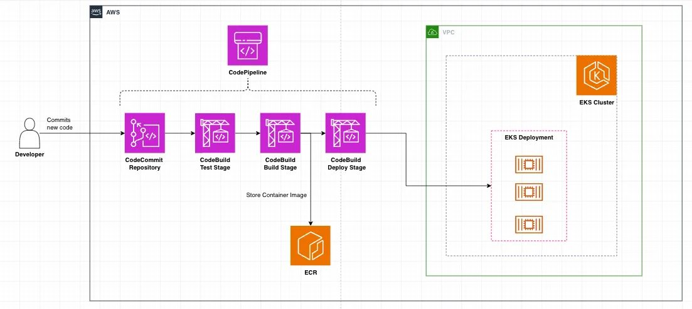
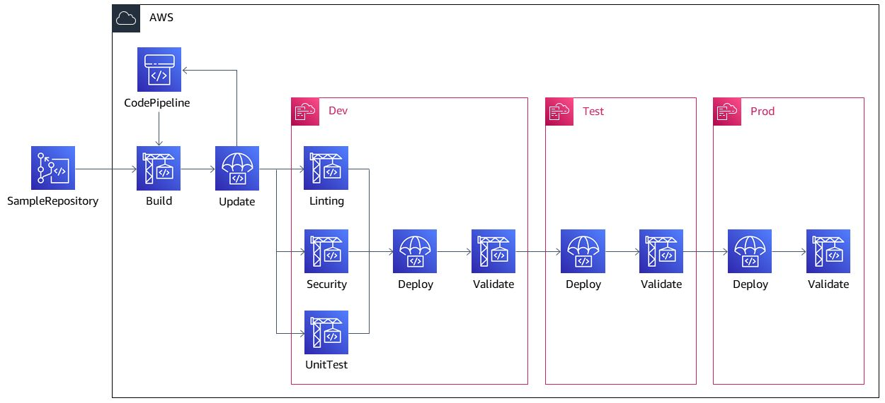

# Summary

Repository to demonstrate RESTful service for performing CRUD operations on the typical customer entity with following attributes

```
	id - unique identifier
	firstName
	middleName
	lastName
	emailAddress
	phoneNumber
```

The application uses a in memory hibernate based SQL database which stores tha above entity in a table and uses JPA to interact with the database from the service layer

## Package structure

The package is built using gradle build logic and follows a typical structure organized as follows 

- `src\main\java` - Contains main source files for the applications
- `src\main\resources` - Contians resource files, in this case a sample json file with some intial data that would be used to populate the database
- `src\test` - Contains unit tests 
- `src\integ` - Contains integration tests

Specific build tasks have been added to ensure unit tests and integration tests are separated out, but both of them are run as part of the normal build task. 


## Running the application 

The application is associated with a `Dockerfile` and respective kubernetes configuration to deploy the application locally [remote image pull has been disabled for now, but might be required for future extension for deploying using CI/CD]

### Step 1
Navigate to the package root, where the `build.gradle.kts` file is present and run : 
```
.\gradlew build
```
This should generate the require jar file under `build\lib` folder with name `customerdataservice-0.0.1.jar`

### Step 2
Package application into docker image by running 
```
 docker build --build-arg JAR_FILE=build/libs/customerdataservice*.jar -t customerdataservice .
```

This should publish the docker image with tage `customerdataservice` to your local docker repo


### Step 3
Start the application by either using local java execution 

```
 java -jar .\build\libs\customerdataservice-0.0.1.jar
```

or using docker 

```
docker run -p 8080:8080 -t customerdataservice
```

both of these should start the application on the port `8080`


### Step 4 - Using Kubernetes
Further if you want to deploy to local kubernetes cluster, the deployment and service configurations are in `deployment.yml` and `service.yml` respectively. Run 

```
kubectl apply -f .\deployment.yaml
kubectl apply -f .\service.yaml

```

This should deploy the service to local kubernetes cluster, you can run `kubectl get all` to validate if its running as expected. 
Furthermore, to interact with the service you can port forward using the following command 

```
kubectl port-forward service/customerdataservice 9090:80
```


## Running Tests

As mentioned before the tests are seggregated between unit and integration tests with capability to run them separately. 

To run unit tests only 

```
 .\gradlew test
```

To run integ tests only 

```
 .\gradlew integ
```


This seggeration via separate gradle tasks would allow us to run the integration test from CI/CD pipeline context as part of approval workflows between stages. Typical CI/CD systems (for example AWS CodePipeline), provide this capability to run build scripts as part of the pipeline steps, and we should be able to utilize those to run integration tests to validate new code being deployed. 

### Note on Integration tests
In current scenario the integration tests are localized, in the sense that it won't make a service call to the actual service that is deployed to a given stage, but it rather validates the end to end business logic using localized spring provided mechanisms. 

In an ideal scenario, where you would typically have interactions over various downstream services and databeses, it would be better to call the endpoint to which the new code was deployed to validate if the service is working as expected with the new code and use that as part of the approval process. This probably woudl require some significant plumbing effort to establish and might be beyond the scope of this demonstration.


## Note on Observability 

The application has basic observability mechanisms in place, via logs and metrics. But these are as of now available within the context on the application instance. Logs are stereamed to console out and metrics are available via spring actuator endpoints. 

This can be further extend, say for example using AWS Cloudwatch, where we should be able to stream the logs to Cloduwatch logs for storage and search. And use micrometer cloduwatch extension, to publish the metrics to cloudwatch metrics. 

This would allow us to monitor the application health and configure alarms based on the metrics that we publish to get real time notifications about application health. 


## CI/CD Design

To take this application and convert it into a CI/CD based deployment, we should be able to use AWS CodePipeline to achieve the same. A typical minimal CI/CD pipleine design would be as follows



To estabilish this design we would have to use the following major AWS services 

`AWS CodeCommit` - We would storing the code in an AWS Code Commit repo and developers would be interacting with this repo similar to normal git repo and push any code changes to the repo. AWS CodeCommit provides all the capabilities similar to any git repo in that you can choose which branch to deploy and use it to publish events to AWS Event bridge to AWS CodePipeline to trigger build

`AWS CodeBuild` - Once the code is pushed to the repository we can use AWS EventBridge to publish a even notification which would trigger a build using `AWS CodeBuild`, we can integrate various aspects like Static Code scanners to validate if the code is fit to be built. Once it passes various code scanes we can build and publish our containirized docker image to ECR. 

`AWS CodeDeploy` - Once the image is published to ECR, we should be able to use AWS Code Deploy to deploy the image to EKS using our the spec that we created, which should further spin up our service instances. 


`AWS CodePipeline` - With these three fundamental aspects we should be able to establish a multi stage pipeline encapsulating them via `AWS CodePipeline` as follows : 



We can phase out the deployment into different stages `Dev` -> `Test` -> `Prod` and each would be a stage in the code pipeline within its own environment. We can run validation tests at each of these stages before we promote the changes to the next stage. As mentioned before, we should able to utilize integration tests as one of the validation tests to make the approvals more of a HOTW (Hands of the wheel). But to begin with its alawys better to have a manual approval for promotion to prod, till we reach a level of confidence on automatic approval mechanims like integration tests, load tests and stress tests. 